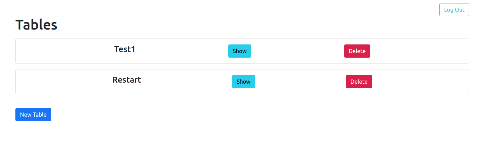
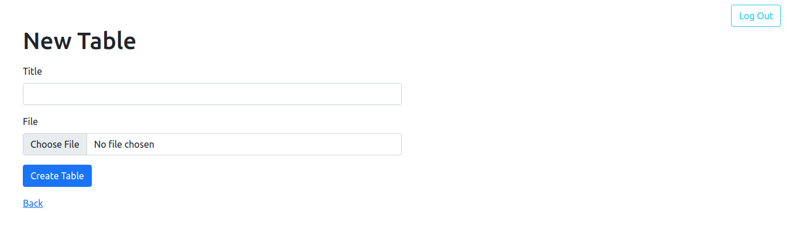
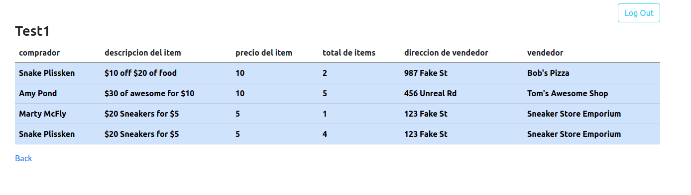
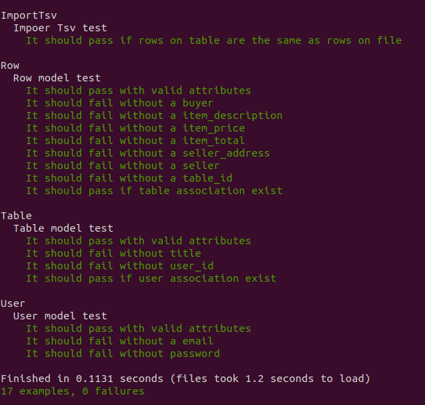

# Talents Code Challenge

This is a coding challenge for Talens Code, Here are some of the main tasks:

- User Authentication
- Allow User to upload csv and tsv files
- Store uploaded files
- Display data for each file
- Test Suite

## Requirments

- Ruby on Rails 6
- Ruby 3.0.0
- yarn

## Installation

Clone the repo

```
> $ git clone https://github.com/pastorp3/TalentsCode-Challenge.git
```

Move inside TalentsCode-Challenge folder and run the next command to install all of the project dependencies

```
> $ bundle install
```

Create the database and run all the migrations 

```
> $ rails db:create && rails db:migrate
```

Install webpacker and all the dependencies

```
> $ yarn install
```

Open Rails Server on your favorite browser
```
> $ rails s
```

## Usage

On the root page, you will be able to log in with your email and password or create a new user.


Once you enter on the app, You will see your tables, add a new table, delete a table or open a table.



If you want to add a new table, you need to add a title field and upload a file.



If you click on the show button on the root page or after creating a table, you will see the title of the table and all the data from the table.



## Test

Run the test suit

```
> $ rspec --format documentation
```



## Author

👤 **José Pedraza**

- Github: [@pastorp3](https://github.com/pastorp3)
- Twitter: [@jose_pastor](https://twitter.com/jose_pastorp3 )
- Linkedin: [linkedin](https://www.linkedin.com/in/jos%C3%A9-pedraza-acevedo-ab700a1a9/)

## 🤝 Contributing

Contributions, issues, and feature requests are welcome!

Feel free to check the [issues page](issues/).

## Show your support

Give a ⭐️ if you like this project!


## 📝 License

This project is [MIT](https://opensource.org/licenses/MIT) licensed.